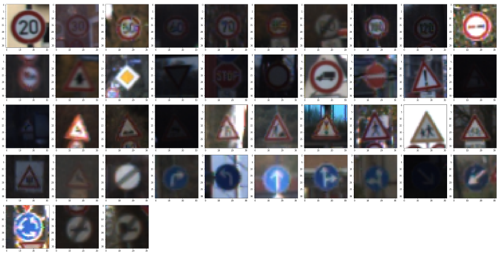
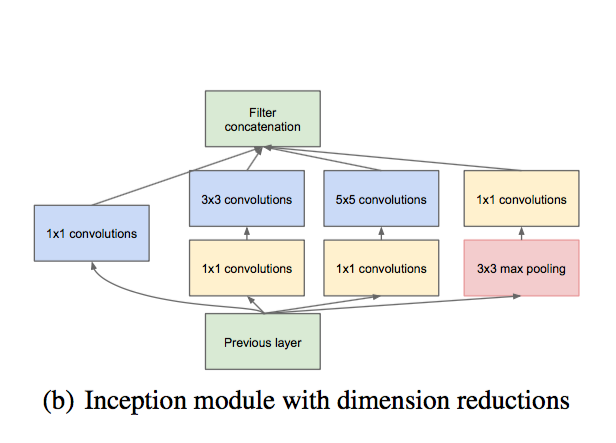
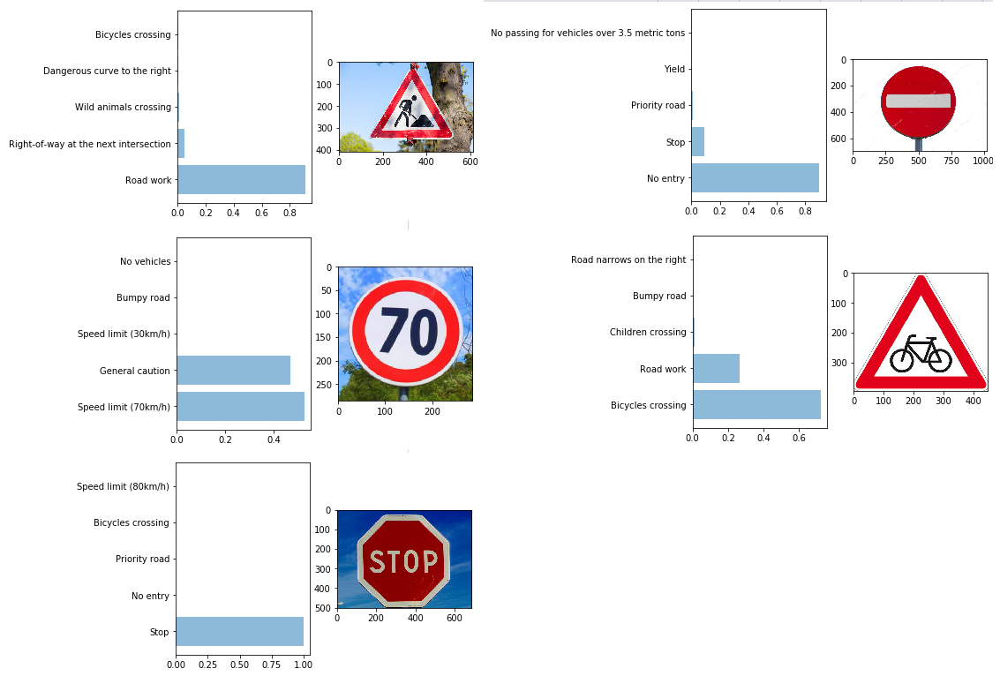

## Traffic Sign Classifier Project

The goals / steps of this project are the following:

* Explore and visualize dataset.
* Preprocess data.
* Create NN model.
* Train model.
* Test model on images from web.

## Data visualization

## Data preprocessing
I normalized all the image data by transformaing all the pixel values into (-0.5, 0.5) interval for better fitting by normal distribution with mu in 0 and sigma 0.1. Also images was croped by using 'sizes' and 'coords' values.

## Model architecture

In this project for traffic sign prediction I decided to use architecture that is similar to Inception network.
This model consists of following layers:
1. Conv layer with relu activation (3 to 3)
2. Conv layer with relu activation (3 to 64)
3. Inception module: it has 3 branches 1x1 convolution, 3x3 convolution, 5x5 convolution that concatinate in the end.
4. Maxpuling
5. Inception module
6. Maxpooling
7. Conv layer x2
8. FC layer x2 

## Training

In order to train this network I used cross entropy loss with softmax and Adam optimizer as an optimization algorithm.
Number of epochs to train the NN is 10.
For waights initialization I used truncated_normal with mu = 0 and sigma = 0.1.
Learning rate was set to 0.0005.
All the data was separated into batches with size 128.
To except overfiting I used dropout with 0.5 drop rate.

As the result of training, NN was able to give pridictions with 0.958 accuracy.

## Test on data from web

The NN successfuly predicted all labels for images that was tooked from web. 
But for 70km/h limitetion sign network wasn't 100% shure about lable and it could be easily confused with general caution sign.

## Posible improvements
Now network can give incorect prediction if traffic sign placed not in center of the image or it's scale or orientation are differ from training examples. To fix that training data should be augmented by shifted, rotated, scaled images.
